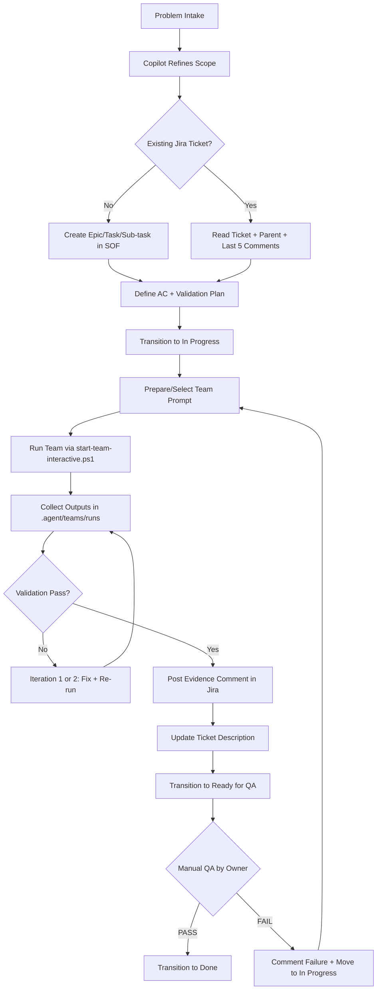

# Kaanbal Orchestration Workflow Guide (Living Document)

## Purpose
Define a single, updateable workflow from problem intake to closure with Jira traceability, team execution, evidence, and manual QA.

## Scope
Use this guide for all meaningful delivery work tied to Jira project `SOF`.

## Prompt vs Global Rules
- Global rules (instructions/context files) are always-on defaults for all team runs and roles.
- Prompt instructions are run-specific objectives and constraints for a particular ticket/run.
- Priority model for execution:
  1. Safety and policy constraints from global rules
  2. Ticket/Epic constraints in Jira
  3. Run-specific prompt details
- If a prompt conflicts with global safety policy, global safety policy wins.

## Flow Summary
1. Intake and refine the problem.
2. Create or reuse Jira issue(s) with clear acceptance criteria.
3. Move ticket to `In Progress` before implementation.
4. Run team execution (max 2 implementation iterations per cycle).
5. Validate with deterministic evidence.
6. Move to `Ready for QA` with full Jira evidence.
7. Manual QA by owner: PASS -> `Done`, FAIL -> back to `In Progress`.

## Mermaid Diagram


## Role Responsibilities (5-Role Mode)
- `sf.orchestrator@kanbaal.dev`: scope refinement, ticket structure, transitions, handoffs.
- `sf.builder@kanbaal.dev`: implementation changes in repos and scripts.
- `sf.runtime@kanbaal.dev`: environment/deploy/runtime checks (cluster, ArgoCD, networking).
- `sf.validation@kanbaal.dev`: deterministic test evidence before `Ready for QA`.
- `sf.riskqa@kanbaal.dev`: risks, blockers, skeptic review and escalation.

## Two-Iteration Policy (Default)
- Limit active implementation loop to 2 iterations before escalation.
- Iteration 1: implement fix and validate.
- Iteration 2: adjust based on failures and validate again.
- If still failing after Iteration 2:
  - Move to `Blocked` if user input/credential/decision is required.
  - Or split scope into a follow-up Jira ticket with explicit dependency.

## Ticket Description Minimum Structure
Use this as the minimum contract in Jira descriptions:

```markdown
## Problem Statement
## Technical Scope
## Solution Implemented
## Acceptance Criteria
## Validation Evidence
## Cross-Ticket Impact
## Artifacts
## Rollback
```

## Evidence Standard (Required Before Ready for QA)
- Commands executed and key outputs summarized.
- Environment checked (`dev/staging/prod`) with expected vs actual.
- URLs/endpoints tested where relevant.
- ArgoCD/app status for deploy changes.
- Files changed and commit SHAs.

## Prompt Versioning and Epic Prompt History
Yes, keeping prompt history at Epic level adds value when used as traceability (not as raw chat dump).

Minimum convention:
1. Version prompts in git under `.agent/teams/prompts/`.
2. Keep run artifacts in `.agent/teams/runs/<timestamp>__<prompt-name>/`.
3. For each meaningful run, post one Jira comment in the Epic with:
  - Prompt file path and version
  - Prompt hash (from `meta.json`)
  - Run timestamp
  - Outcome summary (what changed, what failed, what is next)
  - Linked child tickets impacted

When to record in Epic:
- Record only milestone runs (scope definition, major pivot, release-candidate validation).
- Do not log every micro-run; keep signal high.

Suggested Epic comment template:

```markdown
[PROMPT-RUN]
Epic: SOF-<N>
Prompt: .agent/teams/prompts/<name>-v<N>.prompt.md
Hash: <sha256>
Run: <YYYY-MM-DD HH:mm TZ>
Mode/Model: interactive|non-interactive / <model>

Outcome:
- Implemented:
- Validated:
- Risks/Blockers:
- Next Step:

Tickets impacted:
- SOF-<N>
- SOF-<N>
```

## State Transition Contract
- Agent must move to `In Progress` before coding.
- Agent exit state is `Ready for QA` only after all AC checks pass.
- Owner executes manual QA and decides `Done` or return to `In Progress`.
- Use `Blocked` when work cannot continue without external input.

## How to Update This Guide
When process changes, update this file in the same change-set as the operational scripts/docs.

Checklist:
1. Update the diagram and flow text together.
2. Update role responsibilities if ownership changed.
3. Update iteration policy if governance changed.
4. Add or adjust evidence requirements.
5. Link the related Jira ticket in commit message and description updates.
6. Add a short note in `.agent/LESSONS.md` if the change is reusable.

## Related References
- `.agent/teams/README.md`
- `.agent/context/E2E-TEST-PLAYBOOK.md`
- `_private/SETUP-CREDENTIALS.txt` (credential source, never commit secrets)
